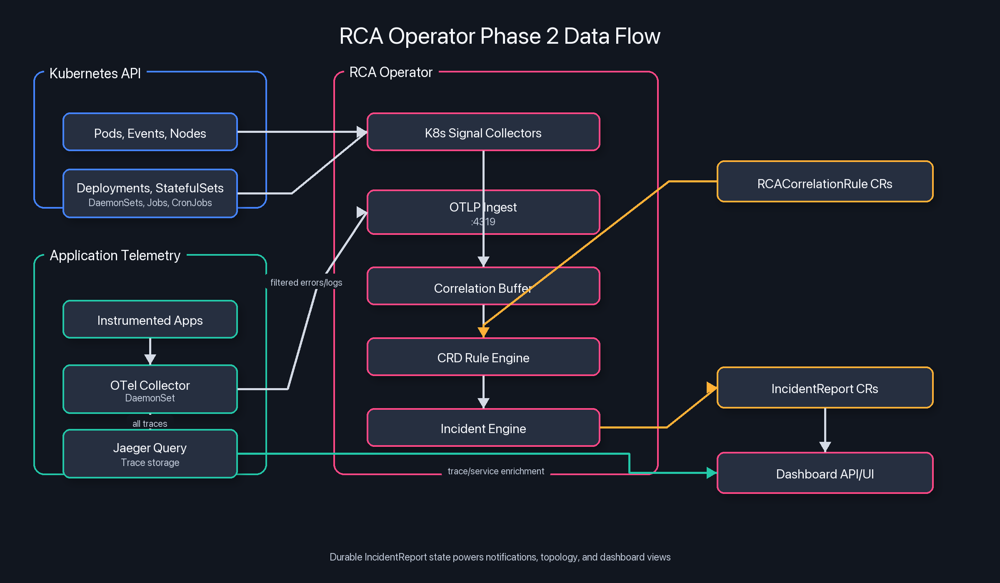

<div align="center">

**RCA Operator for Kubernetes**

*Cluster-native incident detection, durable incident state, CRD-driven correlation rules, notifications, and dashboarding*

[](https://opensource.org/licenses/MIT)
[](https://golang.org)
[](https://kubernetes.io)
[](https://book.kubebuilder.io)

**[rca-operator.tech](https://rca-operator.tech)**

</div>

## What RCA Operator Does

RCA Operator is a Kubernetes-native incident detection operator that:

- collects failure signals from native Kubernetes APIs (pods, events, nodes, deployments)
- evaluates CRD-driven correlation rules (`RCACorrelationRule`) to detect multi-signal incidents
- persists durable incident state in `IncidentReport` CRDs
- manages incident lifecycle: `Detecting` → `Active` → `Resolved`
- notifies humans via Slack and PagerDuty from incident lifecycle state
- serves a built-in dashboard (light/dark theme) backed only by `IncidentReport` and `RCAAgent` CRDs

The operator avoids AI systems, external databases, and log-scraping dependencies so it stays easy to run and reason about in-cluster.

## Architecture



More detail lives in [Architecture](docs/concepts/Architecture.md) and [Phase 1 Architecture](docs/phases/PHASE1_ARCHITECTURE.md).

## Current Feature Set

| Feature | Description |
|---|---|
| Native Kubernetes signal collection | Reads pod, event, node, and workload state from Kubernetes (Deployments, StatefulSets, DaemonSets, Jobs, CronJobs) |
| CRD-driven correlation rules | `RCACorrelationRule` CRDs define multi-signal rules — no Go code changes needed |
| Automatic rule detection | Mines the correlation buffer for recurring signal patterns and auto-creates `RCACorrelationRule` CRDs |
| Durable incident records | Deduplicates repeated signals into one `IncidentReport` per fingerprint |
| Incident lifecycle | Tracks `Detecting`, `Active`, and `Resolved` phases |
| Notifications | Sends Slack and PagerDuty notifications and emits Kubernetes events |
| Dashboard | Built-in incident dashboard with light/dark theme toggle, workload + service topology views, and an inline Jaeger trace detail modal (no Jaeger UI hop) |
| Retention | Automatically prunes old resolved incidents |
| OpenTelemetry | Optional OTLP trace export for the operator's own spans |

## Quick Install

### Helm (recommended)

```bash
# Add repositories (one-time)
helm repo add rca-operator  https://gaurangkudale.github.io/rca-operator.github.io/charts
helm repo add opentelemetry https://open-telemetry.github.io/opentelemetry-helm-charts
helm repo add jaegertracing  https://jaegertracing.github.io/helm-charts
helm repo update

# Install
helm upgrade --install rca-operator rca-operator/rca-operator \
  --namespace rca-system --create-namespace \
  --wait --timeout 10m
```

> `--wait` is required — the `OpenTelemetryCollector` and `Instrumentation` CRs are applied
> as post-install hooks after the otel-operator webhook is confirmed Ready.

### kubectl

```bash
kubectl apply -f https://github.com/gaurangkudale/RCA-Operator/releases/latest/download/install.yaml
kubectl apply -f config/samples/rca_v1alpha1_rcaagent.yaml
```

## Documentation

| Section | Description |
|---|---|
| [Prerequisites](docs/getting-started/prerequisites.md) | Cluster and tooling requirements |
| [Installation](docs/getting-started/installation.md) | Helm and kubectl installation |
| [Quick Start](docs/getting-started/quickstart.md) | Deploy your first agent in minutes |
| [Architecture](docs/concepts/Architecture.md) | System design and data flow |
| [Phase 1 Architecture](docs/phases/PHASE1_ARCHITECTURE.md) | Production target and cleanup baseline |
| [RCAAgent CRD Reference](docs/reference/rcaagent-crd.md) | `RCAAgent` schema and examples |
| [IncidentReport CRD Reference](docs/reference/incidentreport-crd.md) | `IncidentReport` schema and fields |
| [RCACorrelationRule CRD Reference](docs/reference/rcacorrelationrule-crd.md) | Correlation rule schema and examples |
| [Auto-Detection](docs/features/auto-detection.md) | Automatic correlation rule detection |
| [OTLP Ingest](docs/features/otlp-ingest.md) | In-operator OTLP/HTTP receiver for traces and logs |
| [Topology Graph](docs/features/topology-graph.md) | Incident topology graph (K8s + trace + Jaeger enrichment) |
| [Dashboard](docs/features/DASHBOARD.md) | Dashboard data model and access patterns |
| [Metrics Reference](docs/reference/metrics.md) | Prometheus metrics exposed by the operator |
| [RBAC Reference](docs/reference/rbac.md) | Permissions used by the operator |
| [Local Development](docs/development/local-setup.md) | Run locally against a cluster |
| [Testing Guide](docs/development/testing.md) | Unit, envtest, and e2e coverage |
| [Helm Reference](docs/helm-installation.md) | Override flags, from-source install, upgrade, troubleshooting |
| [Helm Upgrade Guide](docs/HELM_UPGRADE.md) | CRD upgrade and migration steps |

## Custom Resources

### RCAAgent

The main configuration resource. One agent can watch multiple namespaces and optionally configure notifications and retention.

```bash
kubectl get rcaagent -A
kubectl describe rcaagent <name> -n <namespace>
```

### IncidentReport

Created automatically for detected incidents. Each report carries the incident fingerprint, lifecycle phase, severity, affected resources, and timeline.

```bash
kubectl get incidentreport -A
kubectl describe incidentreport <name> -n <namespace>
```

### RCACorrelationRule

Cluster-scoped rules that define multi-signal correlation logic. Rules are loaded dynamically — no operator restart needed when rules change.

```bash
kubectl get rcacorrelationrules
kubectl describe rcacorrelationrule <name>
```

Four default rules are installed with the Helm chart (`defaultRules.enabled: true`):

| Rule | Trigger | Condition | Severity |
|---|---|---|---|
| `node-plus-eviction` | NodeNotReady | PodEvicted on same node | P1 |
| `crashloop-plus-oom` | CrashLoopBackOff | OOMKilled on same pod | P2 |
| `crashloop-plus-deploy` | CrashLoopBackOff | StalledRollout in same namespace | P2 |
| `imagepull-no-history` | ImagePullBackOff | No PodHealthy on same pod | P2 |

When auto-detection is enabled (`--enable-autodetect`), the operator also creates rules automatically from observed signal patterns. Auto-generated rules use a fixed priority of 30 (below user rules) and are labeled `rca.rca-operator.tech/auto-generated: "true"`. See [Auto-Detection](docs/features/auto-detection.md) for details.

## Contributing

Contributions are welcome — bug reports, docs, tests, correlation rules, or features.

1. Read [CONTRIBUTING.md](CONTRIBUTING.md) and [CODE_OF_CONDUCT.md](CODE_OF_CONDUCT.md).
2. Find a `good first issue` on the [issue tracker](https://github.com/gaurangkudale/RCA-Operator/issues), or open a new one to discuss larger changes before coding.
3. `make lint && make test && make build` must pass locally.
4. Open a pull request — the [PR template](.github/pull_request_template.md) lists the merge checklist.

## Community & Support

- **Bug reports / feature requests** — [GitHub Issues](https://github.com/gaurangkudale/RCA-Operator/issues)
- **Questions and design discussion** — [GitHub Discussions](https://github.com/gaurangkudale/RCA-Operator/discussions)
- **Security disclosures** — see [SECURITY.md](SECURITY.md); please do **not** open public issues for vulnerabilities.

## License

Licensed under the MIT License. See [LICENSE](LICENSE).
