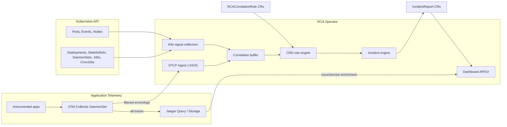
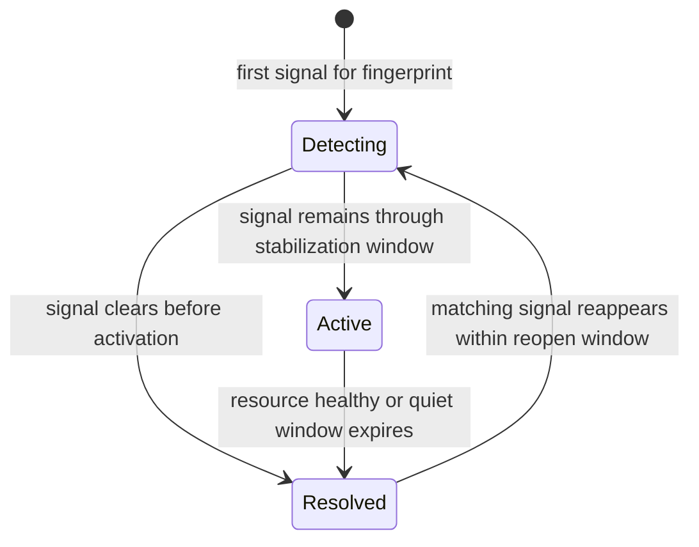

# Architecture

This document summarizes the current Phase 2 architecture for RCA Operator.

## Goal

RCA Operator should answer one question reliably:

> What is broken right now, what resources are affected, and is this the same incident or a new one?

The operator intentionally excludes:

- AI or LLM-based RCA
- autonomous remediation
- external incident databases

## Phase 2 Data Flow



## Incident Lifecycle



## Runtime Topology

```text
Kubernetes API Server
        |
        v
+-----------------------------+
| controller-runtime Manager  |
|  - shared cache             |
|  - leader election          |
|  - health endpoints         |
+-------------+---------------+
              |
      +-------+-------+
      |               |
      v               v
+-----------------------------+   +-----------------------------+
| Signal Collectors           |   | Dashboard API Server        |
|  - node                     |   | Reads IncidentReport CRs    |
|  - pod                      |   | Reads RCAAgent CRs          |
|  - workload (Deployment)    |   | Reads RCACorrelationRule CRs|
|  - statefulset              |   | No raw cluster reads        |
|  - daemonset                |   |                             |
|  - job                      |   |                             |
|  - cronjob                  |   |                             |
|  - event                    |   |                             |
+-------------+---------------+   +-----------------------------+
              |
              v
+-----------------------------+
| CRD-Driven Rule Engine      |
|  - loads RCACorrelationRule |
|  - multi-signal correlation |
|  - priority-based matching  |
+-------------+---------------+
              |
              v
+-----------------------------+
| Incident Engine             |
|  - fingerprinting           |
|  - stabilization            |
|  - deduplication            |
|  - lifecycle transitions    |
+-------------+---------------+
              |
              v
+-----------------------------+
| IncidentReport CRD          |
| Durable source of truth     |
+-------------+---------------+
              |
      +-------+-------+
      |               |
      v               v
+-------------+  +----------------+
| Notifications|  | Dashboard UI   |
| Slack/PD/K8s |  | reads CRs only |
+-------------+  +----------------+
```

## Core Principles

- `IncidentReport` is the durable incident record.
- Signal collection is read-only and Kubernetes-native.
- Correlation rules are defined as `RCACorrelationRule` CRDs, not hardcoded in Go.
- Only one active incident should exist per fingerprint.
- Incident lifecycle is explicit: `Detecting`, `Active`, `Resolved`.
- The dashboard reads normalized incident data only.

## Layer Responsibilities

### Signal Collectors

Collectors observe Kubernetes resources and convert them into normalized failure signals. The Kubernetes-native collectors cover:

- **Pod collector**: CrashLoopBackOff, OOMKilled, ImagePullBackOff, pending, grace period, probe failures
- **Node collector**: NodeNotReady, NodePressure (Disk/Memory/PID)
- **Deployment collector**: StalledRollout (ProgressDeadlineExceeded)
- **StatefulSet collector**: StalledStatefulSet (UpdateRevision != CurrentRevision with incomplete updates)
- **DaemonSet collector**: StalledDaemonSet (UpdatedNumberScheduled < DesiredNumberScheduled)
- **Job collector**: JobFailed (BackoffLimitExceeded, DeadlineExceeded)
- **CronJob collector**: CronJobFailed (child Job in Failed condition)
- **Event collector**: Node events, evictions, probe failures from Kubernetes Event stream
- **OTLP ingest**: OTel span errors, latency spikes, log matches, and span events

### CRD-Driven Rule Engine

Multi-signal correlation rules are defined as `RCACorrelationRule` cluster-scoped CRDs, not hardcoded in Go. The rule engine:

- loads rules dynamically at startup and on CRD changes
- evaluates rules by priority (highest first, first match wins)
- correlates signals within a sliding time window using scope constraints (`samePod`, `sameNode`, `sameNamespace`, `sameTrace`, `any`)
- evaluates OTel attribute predicates against span/log resource attributes

See [RCACorrelationRule Reference](../reference/rcacorrelationrule-crd.md) for the full CRD spec.

### Automatic Rule Detection

When enabled, the auto-detector periodically snapshots the correlation buffer and mines for recurring signal co-occurrence patterns. When a pattern exceeds the occurrence threshold, it auto-creates an `RCACorrelationRule` CRD with a fixed priority of 30 (below user-created rules). Stale auto-generated rules are expired and deleted automatically.

See [Auto-Detection](../features/auto-detection.md) for configuration and details.

### Incident Engine

The incident engine is the single writer for incident lifecycle state. It owns:

- fingerprinting
- deduplication
- stabilization windows
- activation and resolution
- persistence into `IncidentReport`
- trace annotations and topology graph attachment

### Notifications

Notifications are driven from durable incident state, not transient input signals.

### Dashboard

The dashboard serves a static UI and JSON API from the operator process. It reads `IncidentReport`, `RCAAgent`, and `RCACorrelationRule` resources.

API endpoints:

- `GET /api/incidents` — list with filtering, sorting, and pagination
- `GET /api/incidents/{namespace}/{name}` — single incident detail
- `GET /api/stats` — aggregate statistics
- `GET /api/rules` — correlation rules (with auto-generated indicator)
- `GET /api/timeline?fingerprint=...` — unified chronological timeline across all lifecycle phases for a fingerprint
- `GET /api/service-graph` — service dependency graph
- `GET /api/traces/{traceID}` — inline trace detail payload

See [Dashboard](../features/DASHBOARD.md) for full details.

### Observability

RCA Operator exposes Prometheus metrics that track the full incident pipeline:

- Signal ingestion and deduplication rates
- Incident lifecycle transitions (detecting, activated, resolved)
- Active incident gauge
- Phase transition duration histogram
- Notification delivery and correlation rule evaluation

See [Metrics Reference](../reference/metrics.md) for the complete list.

## Production Properties

The operator is production-ready when these properties hold:

- one active incident per fingerprint
- deterministic lifecycle transitions
- safe restart behavior using CR-backed state
- dashboard rendered entirely from CR data
- least-privilege RBAC
- bounded telemetry ingest and metric label cardinality

## Related

- [Phase 1 Architecture](../phases/PHASE1_ARCHITECTURE.md)
- [ADR-0001](../development/architecture-decisions/ADR-0001-phase1-incident-architecture.md)
- [RCAAgent Reference](../reference/rcaagent-crd.md)
- [RCACorrelationRule Reference](../reference/rcacorrelationrule-crd.md)
- [IncidentReport Reference](../reference/incidentreport-crd.md)
- [Phase 2 Release Notes](../phases/PHASE2_RELEASE_NOTES.md)
- [Production Guide](../production.md)
